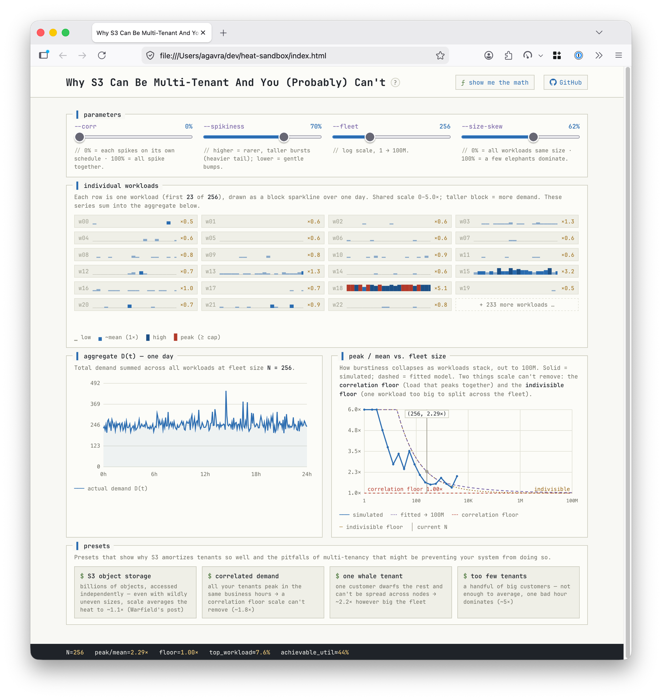

# heat-sandbox

An interactive sandbox for **statistical multiplexing**: when does a fleet of spiky
workloads "balance itself out"?

Inspired by the ["managing heat"](https://www.allthingsdistributed.com/2023/07/building-and-operating-a-pretty-big-storage-system.html)
section of Andy Warfield's S3 post.

[**Live demo →**](https://agavra.github.io/heat-sandbox/)



## Run it

It's a single self-contained `index.html`:

```sh
open index.html
```

## Hosting

Served as a static page (e.g. GitHub Pages); `.nojekyll` disables Jekyll processing.

## License

[MIT](LICENSE)
